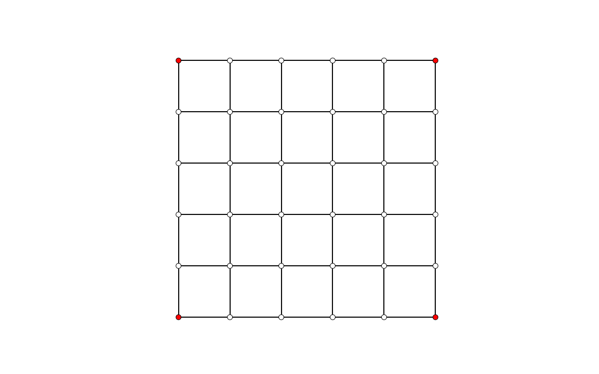

***************************
Mesh Dynamic Relaxation GIF
***************************

Use Dynamic Relaxation to find the equilibrium shape of a mesh.
Save the relaxation process in an animated gif.

.. literalinclude:: mesh-dr-gif.py
    :language: python
