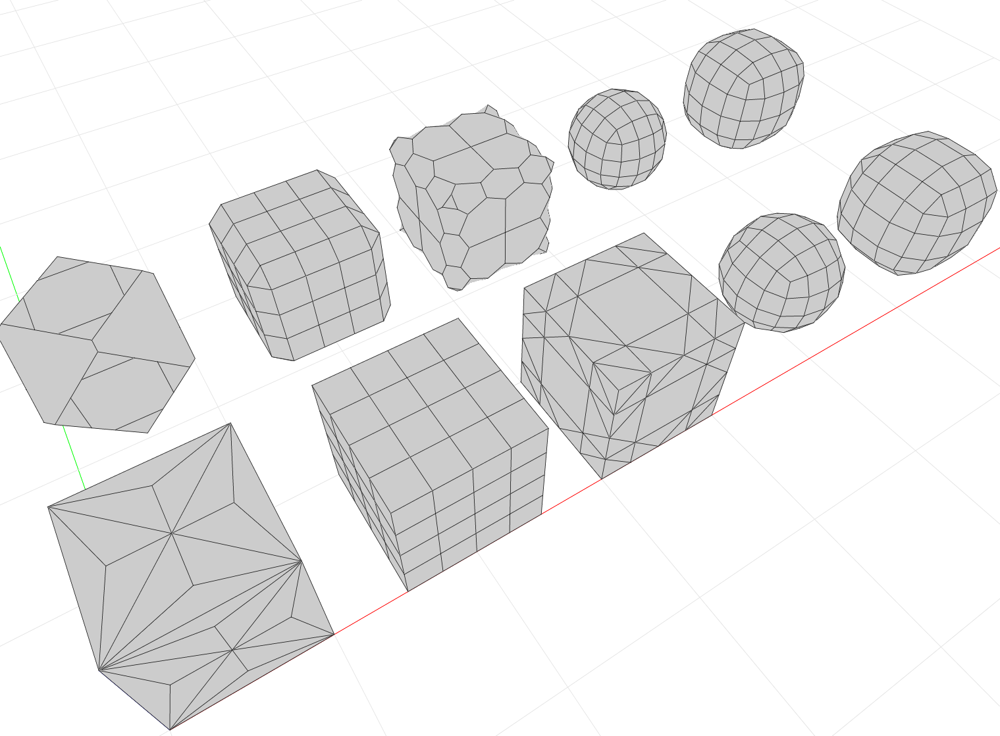

************************
Comparison of Mesh Duals
************************

Side-by-side comparison of dual meshes of various subdivision meshes.

* Environment: Viewer
* COMPAS version: 0.13.0
* Other requirements: :mod:`compas_viewers`

.. literalinclude:: mesh-duals.py
    :language: python
