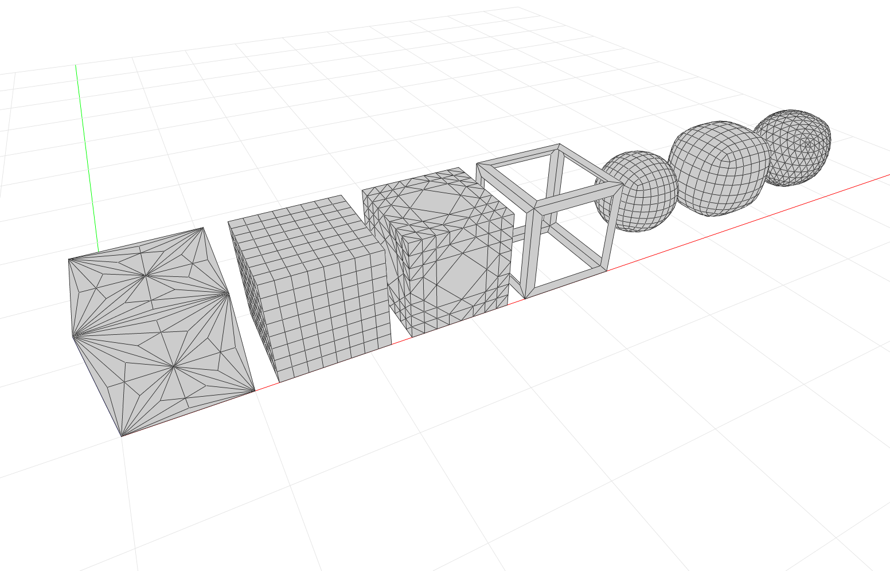

*****************************************
Comparison of Mesh Subdivision Algorithms
*****************************************

Side-by-side comparison of various mesh subdivision algoruthms in COMPAS.

* Environment: Viewer (PySide2 + PyOpengGL)
* COMPAS version: 0.13.0
* Other requirements: :mod:`compas_viewers`

.. literalinclude:: mesh-subd-comparison.py
    :language: python
