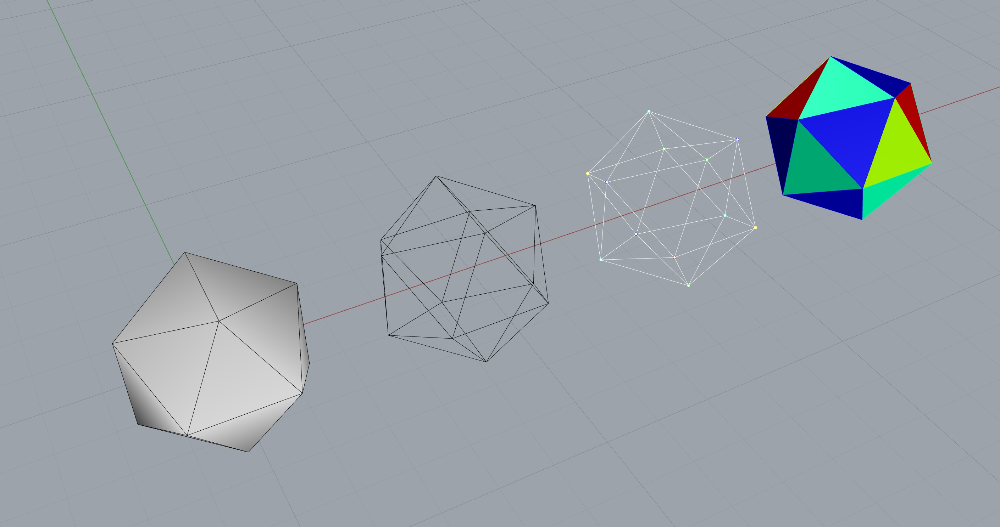

***************************
Mesh Visualization in Rhino
***************************

Use Dynamic Relaxation to find the equilibrium shape of a mesh.
Save the relaxation process in an animated gif.

.. literalinclude:: mesh-viz-rhino.py
    :language: python
